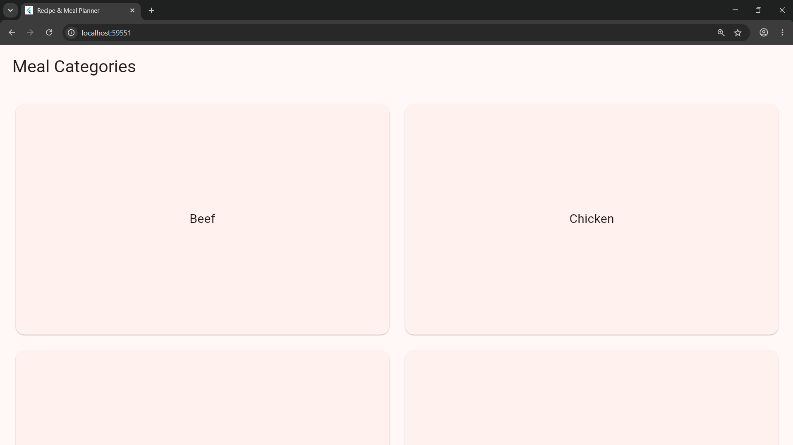

# 🍳 Recipe & Meal Planner App

A cross-platform recipe discovery application built with **Flutter** and **Dart**. This project fetches real-time data from [TheMealDB API](https://www.themealdb.com/) to allow users to explore food categories, browse recipes, view detailed step-by-step cooking instructions, and mark their favorite dishes.

---

## 📥 Download APK
You can download the pre-compiled Android APK directly from the Releases section:
* [**Download v1.0.0 APK**](https://github.com/YOUR_GITHUB_USERNAME/recipe-meal-planner-app/releases/download/v1.0.0/app-release.apk)

---

## 🎥 Demo Video & Screenshots

* 📹 **Video Demo:** [Watch the Project Walkthrough](YOUR_VIDEO_DEMO_LINK_HERE)

### Application Preview
| Categories Screen | Recipe List Screen | Recipe Details Screen |
| :---: | :---: | :---: |
|  |  |  |

---

## 🚀 Key Features

* **Category Explorer:** Browse diverse food categories in an adaptive, responsive grid view.
* **Dynamic Recipe Feeds:** Fetch live lists of recipes corresponding to selected categories.
* **Detailed Recipe Views:** View high-resolution dish previews, category tags, and comprehensive step-by-step cooking instructions.
* **Interactive Session Favorites:** Toggle recipe favorites dynamically with immediate state updates and visual feedback during your session.
* **Resilient User Experience:** Smooth loading indicators, empty states, and clear network error handling.

---

## 🛠️ Tech Stack & Architecture

* **Framework:** [Flutter](https://flutter.dev/) (Dart 3.13 or newer)
* **Networking:** `http` package for RESTful API consumption
* **Data Source:** [TheMealDB Open-Source REST API](https://www.themealdb.com/)
* **State Management:** Native `StatefulWidget` & `setState()`
* **Asynchronous Rendering:** `FutureBuilder` for seamless asynchronous API fetching

The app follows a small, maintainable feature structure:

| Area | Responsibility |
| --- | --- |
| `lib/models/meal.dart` | Converts TheMealDB JSON into typed meal data. |
| `lib/services/api_service.dart` | Makes API requests and validates responses. |
| `lib/screens/category_screen.dart` | Displays categories and handles category selection. |
| `lib/screens/meal_list_screen.dart` | Displays the meals in a category. |
| `lib/screens/meal_detail_screen.dart` | Displays recipe details and the session favourite control. |

```text
lib/
├── models/
│   └── meal.dart           # Typed data modeling & JSON deserialization
├── services/
│   └── api_service.dart    # Asynchronous REST API service & validation
├── screens/
│   ├── category_screen.dart    # Home grid view for meal categories
│   ├── meal_list_screen.dart   # List view for selected category meals
│   └── meal_detail_screen.dart # Detailed recipe view & session favorite state
└── main.dart               # App entrypoint & Material theme configuration
