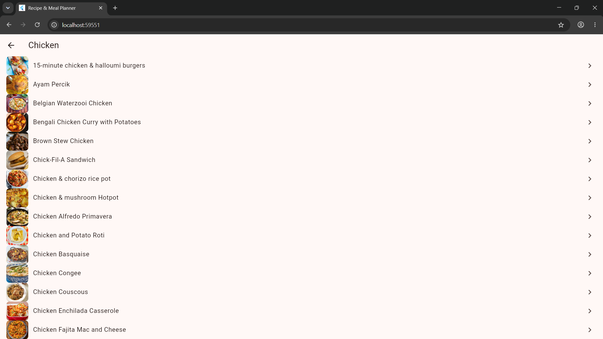
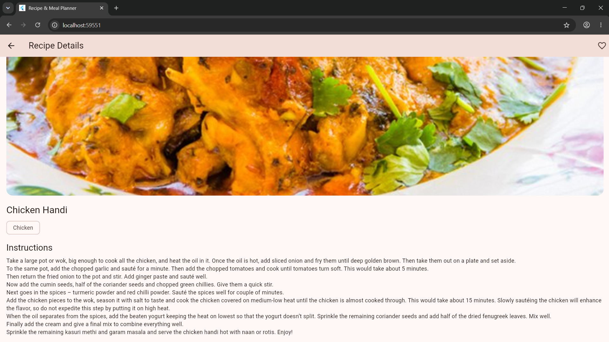

# Recipe & Meal Planner App

A cross-platform recipe discovery application built with **Flutter** and **Dart**. This project fetches real-time data from [TheMealDB API](https://www.themealdb.com/) to allow users to explore food categories, browse recipes, view detailed step-by-step cooking instructions, and mark their favorite dishes.

---

## Download APK
You can download the pre-compiled Android APK directly from the Releases section:
* [**Download v1.0.0 APK**](https://github.com/Shaurya-ja/flutter-recipe-app/releases/tag/v1.0.0)

---

## Demo Video & Screenshots

* 📹 **Video Demo:** [Watch the Project Walkthrough](docs/Demo_Video.mp4)
<video src="docs/Demo_Video.mp4" controls width="100%"></video>
### Application Preview
| Categories Screen | Recipe List Screen | Recipe Details Screen |
| :---: | :---: | :---: |
|  |  |  |

---

## Key Features

* **Category Explorer:** Browse diverse food categories in an adaptive, responsive grid view.
* **Dynamic Recipe Feeds:** Fetch live lists of recipes corresponding to selected categories.
* **Detailed Recipe Views:** View high-resolution dish previews, category tags, and comprehensive step-by-step cooking instructions.
* **Interactive Session Favorites:** Toggle recipe favorites dynamically with immediate state updates and visual feedback during your session.
* **Resilient User Experience:** Smooth loading indicators, empty states, and clear network error handling.

---

## Project Setup & Installation Guide

To run, test, or build this Flutter project locally on your machine, follow these steps:

### Prerequisites
* Ensure you have the **Flutter SDK** (version 3.13 or newer) installed on your system.
* Ensure you have either **Android Studio** (with an Android Virtual Device configured) or **VS Code** with the Flutter and Dart extensions installed.

### 1. Clone the Repository
Open your terminal and clone the project to your local machine:
```bash
git clone https://github.com/Shaurya-ja/flutter-recipe-app.git
cd flutter-recipe-app
```

### 2. Install Dependencies
Fetch all required package dependencies (such as the `http` package) by running:
```bash
flutter pub get
```

### 3. Run the Application
* **To run on an Android Emulator / Connected Device:**
  ```bash
  flutter run
  ```
* **To run locally on Chrome (Web):**
  ```bash
  flutter run -d chrome
  ```

---

## App Usage Instructions

1. **Explore Categories:** Upon launching the app, you will be greeted by the **Category Screen** showcasing various food categories fetched live from [TheMealDB API](https://www.themealdb.com/).
2. **View Recipe List:** Tap on any category card (e.g., Chicken, Dessert) to navigate to the **Meal List Screen** containing recipes belonging to that category.
3. **View Recipe Details & Instructions:** Tap on any specific recipe item to open the **Recipe Details Screen**, where you can review ingredient details and step-by-step cooking instructions.
4. **Manage Favorites:** Toggle the heart/favorite icon on a recipe to save or update your session favorites with immediate visual feedback.

---

## Tech Stack & Architecture

* **Framework:** [Flutter](https://flutter.dev/) (Dart 3.13 or newer)
* **Networking:** `http` package for RESTful API consumption
* **Data Source:** [TheMealDB Open-Source REST API](https://www.themealdb.com/)
* **State Management:** Native `StatefulWidget` & `setState()`
* **Asynchronous Rendering:** `FutureBuilder` for seamless asynchronous API fetching

The app follows a small, maintainable feature structure:

| Area | Responsibility |
| --- | --- |
| `lib/models/meal.dart` | Converts TheMealDB JSON into typed meal data. |
| `lib/services/api_service.dart` | Makes API requests and validates responses. |
| `lib/screens/category_screen.dart` | Displays categories and handles category selection. |
| `lib/screens/meal_list_screen.dart` | Displays the meals in a category. |
| `lib/screens/meal_detail_screen.dart` | Displays recipe details and the session favourite control. |

```text
lib/
├── models/
│   └── meal.dart               # Typed data modeling & JSON deserialization
├── services/
│   └── api_service.dart        # Asynchronous REST API service & validation
├── screens/
│   ├── category_screen.dart    # Home grid view for meal categories
│   ├── meal_list_screen.dart   # List view for selected category meals
│   └── meal_detail_screen.dart # Detailed recipe view & session favorite state
└── main.dart                   # App entrypoint & Material theme configuration
```
